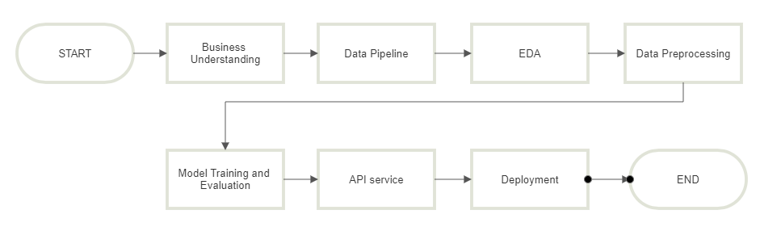
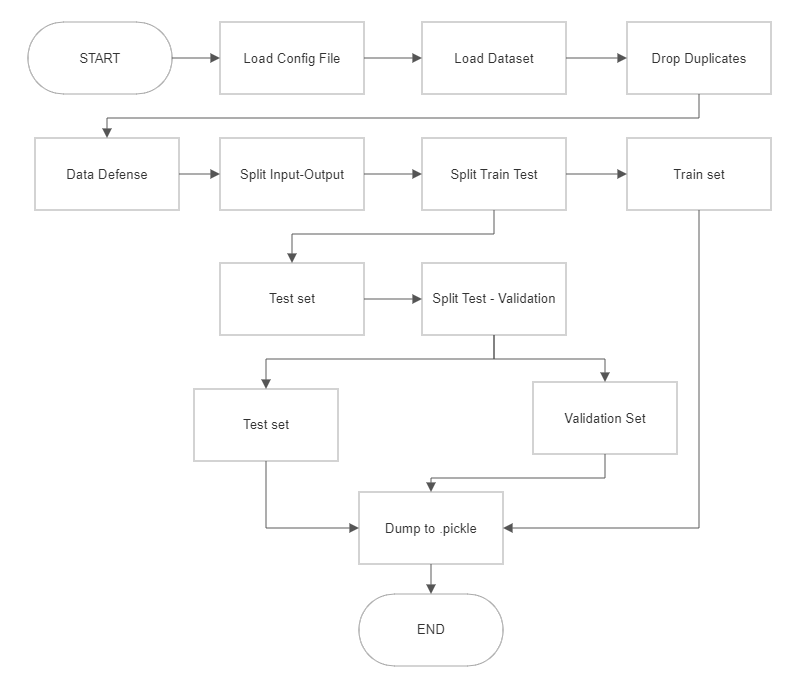
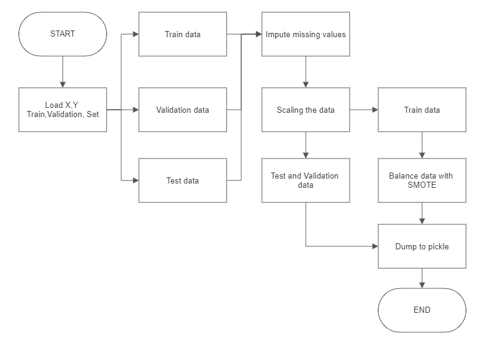
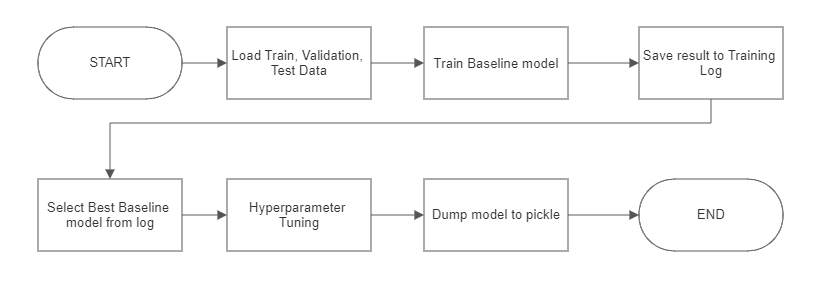
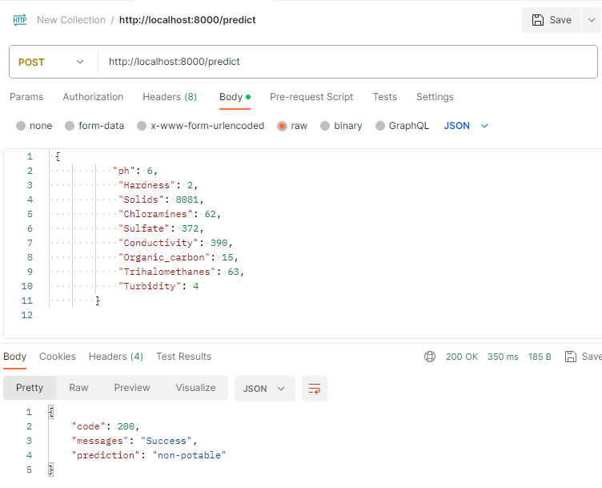
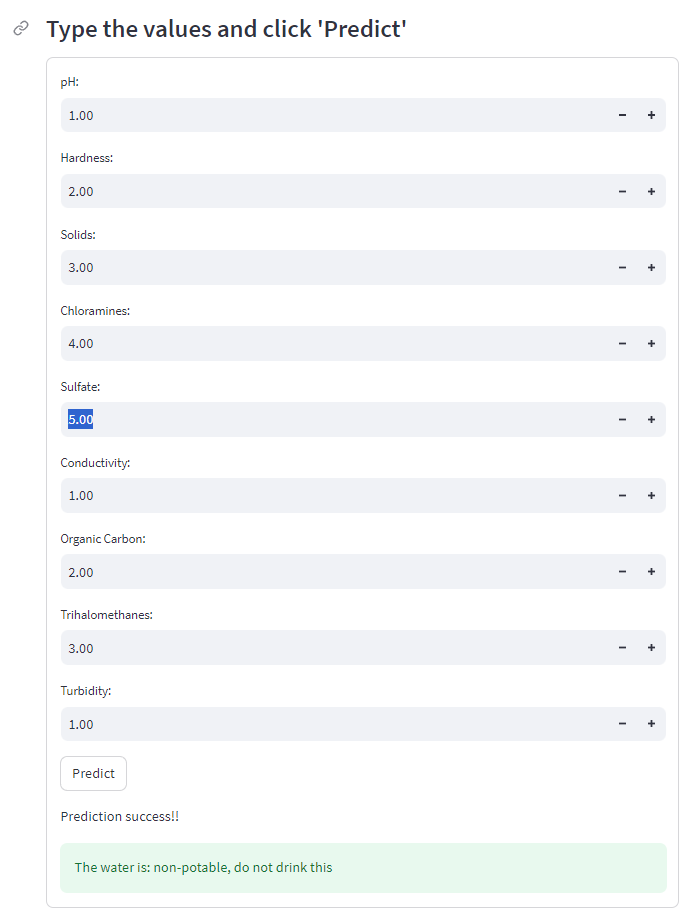
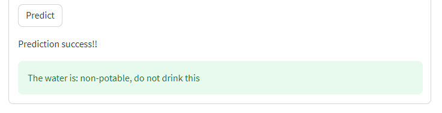

# Water-Classifier

Water Classifier adalah program sederhana berbasis Python untuk klasifikasi water potability menggunakan machine learning

MkDocs: [Link]
Analisa: [Link]

## Background
Air adalah salah kebutuhan dasar bagi kelangsungan hidup seluruh makhluk hidup, termasuk manusia. Menurut WHO, sekitar 2 milyar orang masih menggunakan sumber air yang terkontaminasi. Oleh sebab itu, prediksi kualitas air yang akurat adalah salah satu esensi dari manajemen sumber daya air.

**Water potability** merujuk pada tingkat keamanan air untuk dikonsumsi oleh manusia tanpa menyebabkan risiko kesehatan. Sedangkan **potable water** dapat diartikan sebagai air yang aman diminum. enghilangkan kontaminan. 
Menggunakan semua parameter kualitas air untuk prediksi secara manual tidak realistis dari segi teknis, harga dan masalah variabilitas kualitas air. (Mengyuan Zhu et al., 2022). Oleh sebab itu machine learning bisa menjadi salah satu solusi untuk mengatasi masalah ini.

## Objective
Membuat sistem klasifikasi water potability berbasis machine learning yang memiliki API service untuk diakses user secara **online** dan **local**.

## Dataset
Dataset diambil dari Kaggle, yaitu ["Water Quality"](https://www.kaggle.com/datasets/adityakadiwal/water-potability)

Informasi fitur yang digunakan:

- `**ph**`: Tingkat keasaman/kebasaan air
- `**Hardness**`: Tingkat kandungan kalsium dan magnesium dalam air
- `**Solids**`: Konsentrasi partikel padat terlarut dalam air
- `**Chloramines**`: Kandungan disinfektan jenis chloramine dalam air
-`**Sulfate**`: Kandungan sulfat(SO4) dalam air
- `**Conductivity**`: Tingkat keterhantaran listrik dalam air
- `**Organic Carbon**`: Kandungan kontaminan organik dalam air
- `**Trihalomethanes**`: Kandungan Trihalomethanes/THM dalam air. THM adalah hasil reaksi antara disinfektan dan zat organik dalam air
- `**Turbidity**`: Tingkat kekeruhan air
- `**Potability**`: Klasifikasi apakah air potable/bisa diminum (1) atau non-potable/tidak aman diminum (0)

## Project Architecture

General Workflow

Data Pipeline:

Preprocessing

Modelling

## How to Use

#### Requirements
- Python
- Postman (jika ingin prediksi via API/backend)
- Docker 

### **1. Running the program locally**

Untuk menjalankan program, pertama Clone repository [Water Classifier](https://github.com/christrihardy/Water-Classifier) dari Github

Lalu, buka terminal, masuk ke direktori **'Water-Classifier'** dan jalankan command dibawah ini:

- uvicorn src.water-backend:app --reload
- streamlit run water-frontend.py

Done! Anda bisa memilih untuk prediksi via API atau Streamlit. 

**Note:**

- **Ctrl + C** untuk mematikan service.

#### Running via Docker
Dengan Docker, tidak perlu mengetik command setiap kali ingin mengaktifkan program. 

Masuk ke direktori **'Water-Classifier'** dan jalankan command dibawah ini via terminal:

- sudo docker compose build
- sudo docker compose up -d

Done! Anda bisa memilih untuk prediksi via API atau Streamlit. "**sudo docker compose down**" untuk mematikan service.

**Note:** 

- Docker Desktop harus berjalan di background/dijalankan dulu sebelum menjalankan command diatas
- **sudo docker compose down** untuk mematikan service.

### **2. Prediction via API Service**

Jika ingin melakukan prediksi dengan API, buka url **(nama_host):8000** di aplikasi **Postman** 

Contoh: buka API di local, gunakan localhost:8000 

- Pilih 'Body' dan masukkan teks format variabel prediktor persis seperti di gambar untuk melakukan predict
- Nilai angka prediktor bisa anda ubah 
- Klik **'SEND'**
- Hasil prediksi akan keluar, **Potable** atau **Non-Potable**

### **3. Prediction via Streamlit**

Jika anda ingin tampilan sistem yang lebih *user-friendly*, buka url **(nama_host):8501** di web browser anda

- Masukkan nilai prediktor di kolom yang tertera
- Klik tombol **Predict**

- Hasil prediksi akan keluar, apakah air tersebut **Potable** atau **Non-potable**

### **4. Access the online service**

Jika ingin mengakses prediction service dari penulis, buka link ini: **13.213.57.173:8501**

### **5. Retraining Model**

Untuk retraining model, jalankan ke-3 file Python ini sesuai urutan di folder src:

1. data_pipeline.py
2. preprocessing.py
3. modelling. py

Output dari proses ini adalah file pickle production_model.pkl yang akan digunakan oleh backend API untuk prediksi.

## Conclusion

- F1-score dari production model adalah 61%
- Model bisa digunakan dalam bentuk API atau streamlit

## References
[1]. [Artikel "Drinking Water"](https://www.who.int/news-room/fact-sheets/detail/drinking-water)

[2]. [Artikel "A quest for quality: Better metrics on water quality are key to corporate action on pollution"](https://towardsdatascience.com/multi-collinearity-in-regression-fe7a2c1467ea)

[3]. ["A review of the application of machine learning in water quality evaluation"](https://www.sciencedirect.com/science/article/pii/S2772985022000163)

[4]. ["F1 Score The Ultimate Guide"](https://spotintelligence.com/2023/05/08/f1-score/)

