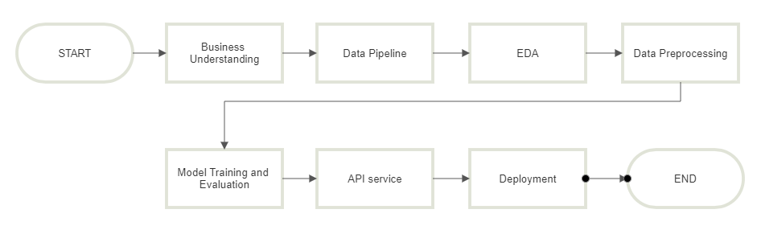
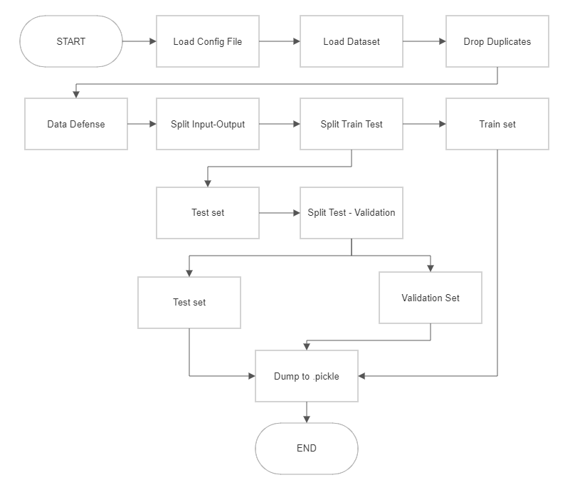
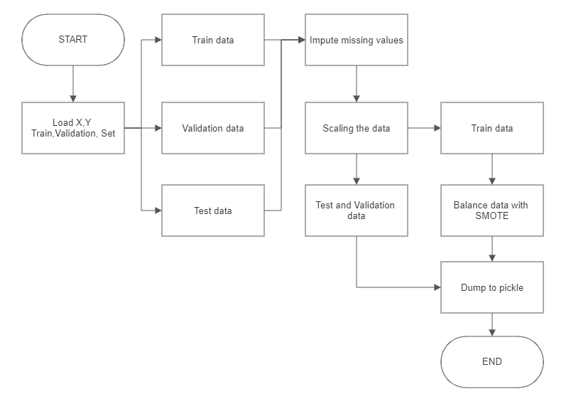

# **Project Description**

## **1. Background & Problem**

Air adalah salah kebutuhan dasar bagi kelangsungan hidup seluruh makhluk hidup, termasuk manusia. Namun seiring berkembangnya peradaban, sumber air minum bersih  pun semakin berkurang. Menurut WHO, sekitar 2 milyar orang masih menggunakan sumber air yang terkontaminasi. Setiap tahunya, diperkirakan 829.000 orang meninggal karena diare yang disebabkan oleh sumber air yang tidak aman diminum dan sanitasi yang buruk¹. Oleh sebab itu, prediksi kualitas air yang akurat adalah salah satu esensi dari manajemen sumber daya air.

Water potability merujuk pada tingkat keamanan air untuk dikonsumsi oleh manusia tanpa menyebabkan risiko kesehatan. Sedangkan potable water dapat diartikan sebagai air yang aman diminum. 

## **2. Objective & Metrics**
### 2.1. High Level Approach

Dari permasalahan diatas  maka dibuatlah sistem klasifikasi untuk menentukan apakah suatu sumber air itu potable atau non-potable. Penulis memutuskan untuk membuat sistem klasifikasi berbasis machine learning untuk masalah ini.

### 2.2. Goals and Success
**Business Objective**

Membantu user atau perusahaan dalam mencari sumber air yang aman untuk diminum dan terhindar dari sumber air yang tidak aman.
**Business Metrics**

Sistem klasifikasi yang cukup akurat dalam menentukan tingkat water potability .

**Machine Learning Solution**

Melalui machine learning, kita dapat membuat algoritma yang dapat digunakan untuk menganalisa dan mencari pola tertentu dalam suatu data untuk memprediksi informasi baru³. Dengan metode ini, kita bisa membuat suatu sistem yang dapat memprediksi tingkat water potability suatu sumber air dengan memasukkan data tingkat kontaminan dari sumber air tersebut ke algoritma machine learning tersebut. 

**Machine Learning Metrics**

- Jika sistem ML memprediksi suatu sumber air potable namun ternyata non potable (false positive) maka yang meminum dapat terkena penyakit atau masalah kesehatan lain.
- Jika sistem ML memprediksi suatu sumber air non-potable namun ternyata potable (false negative) maka perusahaan atau masyarakat harus mencari lagi sumber air lain yang potable. Mencari sumber air lain dapat memakan waktu dan biaya yang tidak sedikit.

Resiko false positive dan false negative cukup seimbang, oleh karena itu **F1-score** dipilih sebagai metrik.

## **3. Project Architecture**

General Workflow

Data Pipeline:

Preprocessing

Modelling

## **4. Expected Output**

- Production Model
- API Service as backend
- Streamlit Website as frontend
- Deployment in AWS

