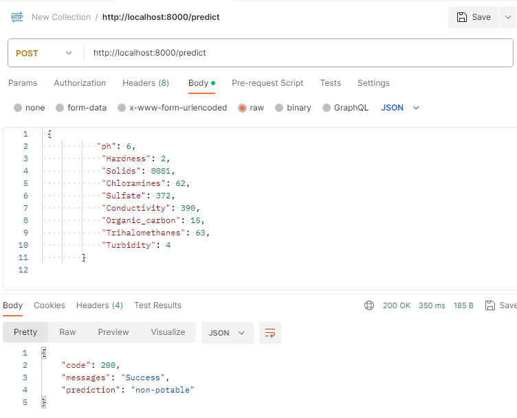
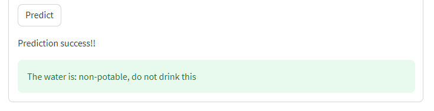

# **How to Use**

## Requirements
- Postman (jika ingin prediksi via API/backend)

## **1. Prediction via API Service**

Jika ingin melakukan prediksi dengan API, buka url **(nama_host):8000** di aplikasi **Postman** 

Contoh: buka API di local, gunakan localhost:8000 

- Pilih 'Body' dan masukkan teks format variabel prediktor persis seperti di gambar untuk melakukan predict
- Nilai angka prediktor bisa anda ubah 
- Klik **'SEND'**
- Hasil prediksi akan keluar, **Potable** atau **Non-Potable**

## **2. Prediction via Streamlit**

Jika anda ingin tampilan sistem yang lebih *user-friendly*, buka url **(nama_host):8501** di web browser anda

- Masukkan nilai prediktor di kolom yang tertera
- Klik tombol **Predict**

- Hasil prediksi akan keluar, apakah air tersebut **Potable** atau **Non-potable**

## **3. Retraining Model**

Untuk retraining model, jalankan ke-3 file Python ini sesuai urutan di folder src:

1. data_pipeline.py
2. preprocessing.py
3. modelling. py

Output dari proses ini adalah file pickle production_model.pkl yang akan digunakan oleh backend API untuk prediksi.